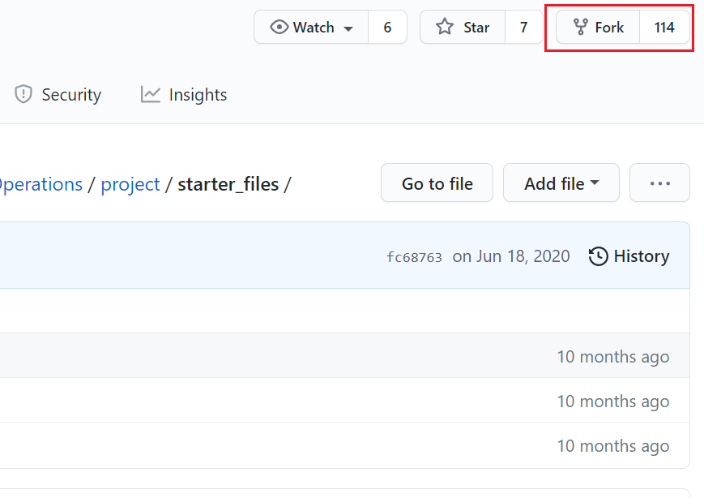

# Udacity Azure Operation Project

## Getting started
### Directory structure
```
availability_set
|   .gitignore
|   README.md
|   tree.txt
|   
+---packer  # This contains pakcer template 
|       web-server.json
|       
\---terraform
    |   main.tf 
    |   variables.tf
    |   
    \---modules # This contains reusable modules
        +---avset # Module for deploying avset
        |       main.tf
        |       variables.tf
        |       
        \---init # Module for deploying initial resources
                main.tf
                outputs.tf
                variables.tf
```
### Diagram

## Instruction
### Clone the repository
- `Fork` the Udacity repository from Github page.


- Switch to your Github site, get the `https` link from the forked repository.


- 
